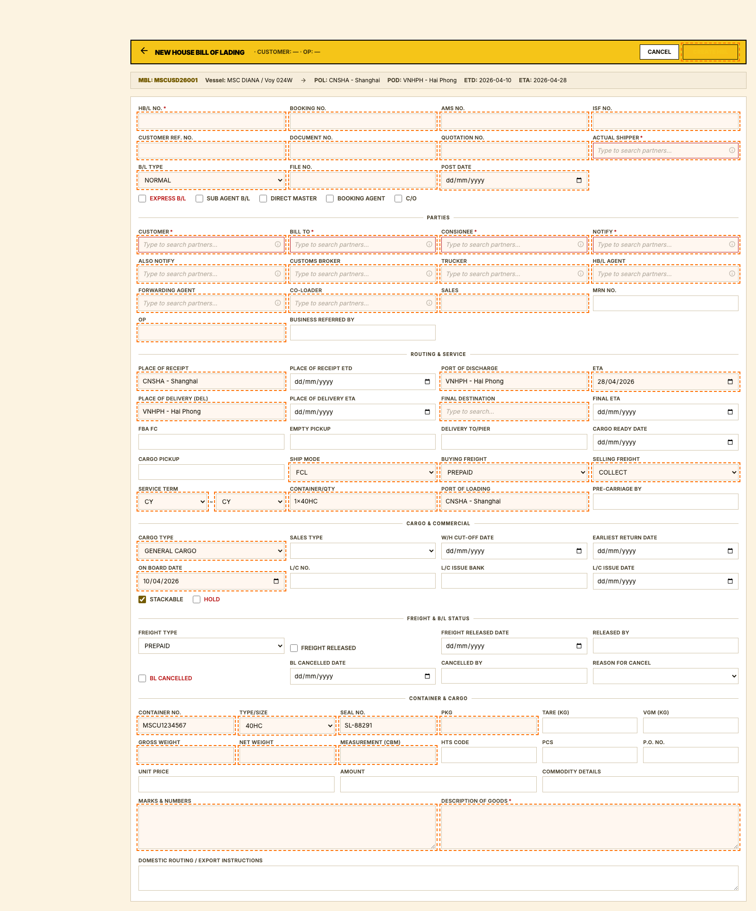
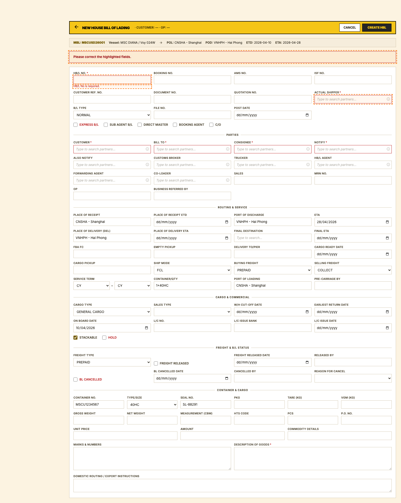

# House Bill of Lading (HBL)

## User Story
As an Ocean Export operator, I want to create and validate HBL records linked to an existing MBL so that customer-level shipment details are accurate and ready for document issuance.

## Form Sections
1. Parties
2. Routing & Service
3. Cargo & Commercial
4. Freight & B/L Status
5. Container & Cargo

## UI Evidence

_New HBL form opened under a seeded MBL — MBL banner visible at top, all HBL fields below._

_Submit empty HBL form to capture required-field error state._

## Acceptance Criteria
1. User can navigate to the list and open the create form without a UI error or blank screen.
2. All form sections (Identification, Vessel & Routing, Freight & Service, Container & Item Summary) are rendered and scrollable.
3. Submitting the form with empty required fields shows inline error messages without a page reload.
4. A valid record can be saved and the system redirects to the detail/list view with the new record visible.
5. All dropdown (select) options match the values defined in the application constants.
6. Date fields only accept valid date input (ISO YYYY-MM-DD) and do not accept free-form text.

## Validation Rules
1. **HB/L No.*** (`name="hbl_no"`) must not be empty; form must block submission and highlight the field with an error message.
2. **Actual Shipper*** (`name="actual_shipper_id"`) must not be empty; form must block submission and highlight the field with an error message.

## Field Semantics
| Label | Tag | Name | Type | Required | Business Meaning | Allowed Values / Format | Data Source / Reference | Notes |
|---|---|---|---|---|---|---|---|---|
| HB/L No.* | input | `hbl_no` | text | No | The House Bill of Lading number — the customer-facing document reference used by the shipper and consignee for all correspondence and customs clearance. | Free text | Entered directly by the user and stored in the shipment record. | - |
| Booking No. | input | `booking_no` | text | No | The booking or reservation reference number assigned at the time the space was confirmed. | Free text | Entered directly by the user and stored in the shipment record. | - |
| AMS No. | input | `ams_no` | text | No | Automated Manifest System (AMS) filing number submitted to U.S. Customs. Required for all cargo destined for or transiting through the United States. | Free text | Entered directly by the user and stored in the shipment record. | - |
| ISF No. | input | `isf_no` | text | No | Importer Security Filing (ISF / 10+2) number filed with U.S. Customs. Must be submitted at least 24 hours before cargo is loaded at origin. | Free text | Entered directly by the user and stored in the shipment record. | - |
| Customer Ref. No. | input | `customer_ref_no` | text | No | The customer's own internal reference number for this shipment, for their records. | Free text | Entered directly by the user and stored in the shipment record. | - |
| Document No. | input | `document_no` | text | No | Soleil's internal document control number assigned to this House BL. | Free text | Entered directly by the user and stored in the shipment record. | - |
| Quotation No. | input | `quotation_no` | text | No | The sales quotation number that was accepted and led to this booking. | Free text | Entered directly by the user and stored in the shipment record. | - |
| Actual Shipper* | input | `actual_shipper_id` | text | No | The company or individual physically shipping the goods — the exporter of record on customs documents. | Free text | Trade Partner lookup — internal partner database (GET /trade-partners/). Search by company name or partner code. New partners must be created in the Trade Partners module first. | - |
| B/L Type | select | `bl_type` | - | No | Defines the commercial arrangement for how this Bill of Lading is structured and billed — e.g., whether it is a direct shipment, a consolidation, or a co-load. | CARRIER BUYER CONSOL, CO-LOAD, CONSOL, DIRECT, DIRECT TRIANGLE, FORWARDING, NORMAL, THIRD PARTY, TRIANGLE | Fixed dropdown list configured in the application. | - |
| File No. | input | `file_no` | text | No | Internal job number automatically assigned by the system when the record is first saved. Used for cross-referencing invoices, correspondence, and reports. | Free text | Entered directly by the user and stored in the shipment record. | - |
| Post Date | input | `post_date` | date | No | The date this document is officially recorded in the system. Defaults to today. | Date (YYYY-MM-DD) | Entered directly by the user and stored in the shipment record. | - |
| Express B/L | input | `express_bl` | checkbox | No | Express B/L. | Yes / No | Entered directly by the user and stored in the shipment record. | - |
| Sub Agent B/L | input | `sub_agent_bl` | checkbox | No | Sub Agent B/L. | Yes / No | Entered directly by the user and stored in the shipment record. | - |
| Direct Master | input | `direct_master` | checkbox | No | Indicates that this shipment moves directly under a master BL without co-loading or consolidation with other cargo. | Yes / No | Entered directly by the user and stored in the shipment record. | - |
| Booking Agent | input | `booking_agent` | checkbox | No | Check this box if the booking was arranged through an agent rather than placed directly with the carrier. | Yes / No | Entered directly by the user and stored in the shipment record. | - |
| C/O | input | `co_flag` | checkbox | No | Check this box if a Certificate of Origin is required for this shipment. | Yes / No | Entered directly by the user and stored in the shipment record. | - |
| Customer* | input | `customer_id` | text | No | The Soleil customer account responsible for this shipment. Typically the party that signed the service agreement. | Free text | Trade Partner lookup — internal partner database (GET /trade-partners/). Search by company name or partner code. New partners must be created in the Trade Partners module first. | - |
| Bill To* | input | `bill_to_id` | text | No | The party to be invoiced for Soleil's services. May be different from the customer if a third party is covering freight costs. | Free text | Trade Partner lookup — internal partner database (GET /trade-partners/). Search by company name or partner code. New partners must be created in the Trade Partners module first. | - |
| Consignee* | input | `consignee_id` | text | No | The party designated to receive the cargo at the destination. Their name appears on the Bill of Lading and customs entry. | Free text | Trade Partner lookup — internal partner database (GET /trade-partners/). Search by company name or partner code. New partners must be created in the Trade Partners module first. | - |
| Notify* | input | `notify_party_id` | text | No | The party to be notified when the cargo arrives at the destination port. Typically the consignee or their broker. | Free text | Trade Partner lookup — internal partner database (GET /trade-partners/). Search by company name or partner code. New partners must be created in the Trade Partners module first. | - |
| Also Notify | input | `also_notify_id` | text | No | An additional party to receive arrival notifications, in addition to the primary notify party. | Free text | Trade Partner lookup — internal partner database (GET /trade-partners/). Search by company name or partner code. New partners must be created in the Trade Partners module first. | - |
| Customs Broker | input | `customs_broker_id` | text | No | The licensed customs broker handling import clearance at the destination port. | Free text | Trade Partner lookup — internal partner database (GET /trade-partners/). Search by company name or partner code. New partners must be created in the Trade Partners module first. | - |
| Trucker | input | `trucker_id` | text | No | The trucking company responsible for inland pickup or delivery of the cargo. | Free text | Trade Partner lookup — internal partner database (GET /trade-partners/). Search by company name or partner code. New partners must be created in the Trade Partners module first. | - |
| HB/L Agent | input | `hbl_agent_id` | text | No | The agent responsible for issuing the House BL and managing the documentation at destination. | Free text | Trade Partner lookup — internal partner database (GET /trade-partners/). Search by company name or partner code. New partners must be created in the Trade Partners module first. | - |
| Forwarding Agent | input | `forwarding_agent_id` | text | No | The freight forwarder coordinating the shipment on behalf of the shipper. | Free text | Trade Partner lookup — internal partner database (GET /trade-partners/). Search by company name or partner code. New partners must be created in the Trade Partners module first. | - |
| Co-loader | input | `co_loader_id` | text | No | The co-loading partner that shares container space on this shipment. | Free text | Trade Partner lookup — internal partner database (GET /trade-partners/). Search by company name or partner code. New partners must be created in the Trade Partners module first. | - |
| Sales | input | `sales` | text | No | The Soleil sales representative who brought in this business and is responsible for the customer relationship. | Free text | Entered directly by the user and stored in the shipment record. | - |
| MRN No. | input | `mrn_no` | text | No | Movement Reference Number assigned by customs authorities for the export declaration. | Free text | Entered directly by the user and stored in the shipment record. | - |
| OP | input | `op` | text | No | The operations staff member assigned as the primary handler for this shipment. | Free text | Entered directly by the user and stored in the shipment record. | - |
| Business Referred By | input | `business_referred_by` | text | No | The person or company who referred this customer or shipment to Soleil. | Free text | Entered directly by the user and stored in the shipment record. | - |
| Place of Receipt | input | `place_of_receipt` | text | No | The location where Soleil or its agent takes custody of the cargo from the shipper — the starting point of Soleil's responsibility. | Free text | Location lookup — UN/LOCODE database (GET /api/locations). Type at least 2 characters to search by city name or LOCODE code. | - |
| Place of Receipt ETD | input | `place_of_receipt_etd` | date | No | Estimated departure date from the place of receipt (inland origin). | Date (YYYY-MM-DD) | Entered directly by the user and stored in the shipment record. | - |
| Port of Discharge | input | `port_of_discharge` | text | No | The seaport where the cargo is unloaded from the vessel. | Free text | Location lookup — UN/LOCODE database (GET /api/locations). Type at least 2 characters to search by city name or LOCODE code. | - |
| ETA | input | `eta` | date | No | Estimated arrival date of the vessel at the port of discharge. | Date (YYYY-MM-DD) | Entered directly by the user and stored in the shipment record. | - |
| Place of Delivery (DEL) | input | `place_of_delivery` | text | No | The final delivery point where Soleil hands over the cargo to the consignee. | Free text | Location lookup — UN/LOCODE database (GET /api/locations). Type at least 2 characters to search by city name or LOCODE code. | - |
| Place of Delivery ETA | input | `place_of_delivery_eta` | date | No | Estimated arrival date at the final delivery location. | Date (YYYY-MM-DD) | Entered directly by the user and stored in the shipment record. | - |
| Final Destination | input | `final_destination` | text | No | The ultimate end destination of the cargo, which may be further inland beyond the port of delivery. | Free text | Location lookup — UN/LOCODE database (GET /api/locations). Type at least 2 characters to search by city name or LOCODE code. | - |
| Final ETA | input | `final_eta` | date | No | Estimated arrival date at the final destination. | Date (YYYY-MM-DD) | Entered directly by the user and stored in the shipment record. | - |
| FBA FC | input | `fba_fc` | text | No | Amazon Fulfillment Center code — the specific warehouse destination code for shipments going to Amazon FBA. | Free text | Entered directly by the user and stored in the shipment record. | - |
| Empty Pickup | input | `empty_pickup` | text | No | The depot or location where the shipper picks up the empty container before stuffing. | Free text | Location lookup — UN/LOCODE database (GET /api/locations). Type at least 2 characters to search by city name or LOCODE code. | - |
| Delivery To/Pier | input | `delivery_to_pier` | text | No | The terminal or pier location where the loaded container is delivered for vessel loading. | Free text | Location lookup — UN/LOCODE database (GET /api/locations). Type at least 2 characters to search by city name or LOCODE code. | - |
| Cargo Ready Date | input | `cargo_ready_date` | date | No | The date the cargo will be ready at the shipper's facility for pickup or delivery to the warehouse. | Date (YYYY-MM-DD) | Entered directly by the user and stored in the shipment record. | - |
| Cargo Pickup | input | `cargo_pickup` | text | No | Cargo Pickup. | Free text | Entered directly by the user and stored in the shipment record. | - |
| Ship Mode | select | `ship_mode` | - | No | The type of cargo arrangement for this shipment — how the container or cargo space is booked. | FCL, LCL, BULK, RORO | Fixed dropdown list configured in the application. | - |
| Buying Freight | select | `buying_freight` | - | No | Freight payment terms for what Soleil pays to the carrier or co-loader for this shipment (our cost side). | PREPAID, COLLECT, OTHER | Fixed dropdown list configured in the application. | - |
| Selling Freight | select | `selling_freight` | - | No | Freight payment terms for what the customer pays to Soleil (our revenue side). | PREPAID, COLLECT, OTHER | Fixed dropdown list configured in the application. | - |
| Service Term | select | `svc_term_origin` | - | No | Defines the scope of Soleil's service at the origin — the point from which Soleil takes responsibility for the cargo. | CY, CFS, DOOR | Fixed dropdown list configured in the application. | - |
| Service Term | select | `svc_term_dest` | - | No | Defines the scope of Soleil's service at the destination — the point until which Soleil is responsible for the cargo. | CY, CFS, DOOR | Fixed dropdown list configured in the application. | - |
| Container/Qty | input | `container_qty` | text | No | The total number of containers booked on this shipment. | Free text | Entered directly by the user and stored in the shipment record. | - |
| Port of Loading | input | `port_of_loading` | text | No | The seaport where the cargo is loaded onto the ocean vessel. | Free text | Location lookup — UN/LOCODE database (GET /api/locations). Type at least 2 characters to search by city name or LOCODE code. | - |
| Pre-carriage By | input | `pre_carriage_by` | text | No | The mode of transport (truck, rail, feeder vessel) used to move cargo from the place of receipt to the port of loading. | Free text | Entered directly by the user and stored in the shipment record. | - |
| Cargo Type | select | `cargo_type` | - | No | The category of goods being shipped — determines handling requirements, storage conditions, and regulatory documentation needed. | GENERAL CARGO, DANGEROUS GOODS, REFRIGERATED, BREAK BULK, OVERSIZED, VEHICLES | Fixed dropdown list configured in the application. | - |
| Sales Type | select | `sales_type` | - | No | The commercial direction of this shipment, used for sales performance tracking and reporting. | EXPORT, IMPORT, CROSS TRADE, DOMESTIC | Fixed dropdown list configured in the application. | - |
| W/H Cut-Off Date | input | `wh_cut_off_date` | date | No | The deadline for delivering cargo to Soleil's consolidation warehouse. | Date (YYYY-MM-DD) | Entered directly by the user and stored in the shipment record. | - |
| Earliest Return Date | input | `earliest_return_date` | date | No | The earliest date the carrier will accept empty container returns to the depot after delivery. | Date (YYYY-MM-DD) | Entered directly by the user and stored in the shipment record. | - |
| On Board Date | input | `on_board_date` | date | No | The date the cargo was physically loaded and confirmed on board the vessel. | Date (YYYY-MM-DD) | Entered directly by the user and stored in the shipment record. | - |
| L/C No. | input | `lc_no` | text | No | The Letter of Credit number if payment for this shipment is settled through a bank Letter of Credit. | Free text | Entered directly by the user and stored in the shipment record. | - |
| L/C Issue Bank | input | `lc_issue_bank` | text | No | The bank that issued the Letter of Credit. | Free text | Entered directly by the user and stored in the shipment record. | - |
| L/C Issue Date | input | `lc_issue_date` | date | No | The date the Letter of Credit was issued by the bank. | Date (YYYY-MM-DD) | Entered directly by the user and stored in the shipment record. | - |
| Stackable | input | `stackable` | checkbox | No | Indicates whether this cargo or container may be stacked on top of or underneath other cargo during storage or transport. | Yes / No | Entered directly by the user and stored in the shipment record. | - |
| Hold | input | `hold` | checkbox | No | Flags this shipment as on financial or operational hold. Shipment cannot proceed until the hold is released by an authorized staff member. | Yes / No | Entered directly by the user and stored in the shipment record. | - |
| Freight Type | select | `freight_type` | - | No | Indicates who pays the ocean freight charges — the shipper (Prepaid) or the consignee (Collect). | PREPAID, COLLECT | Fixed dropdown list configured in the application. | - |
| Freight Released | input | `freight_released` | checkbox | No | Indicates that all outstanding freight charges have been paid and the BL has been approved for cargo release. | Yes / No | Entered directly by the user and stored in the shipment record. | - |
| Freight Released Date | input | `freight_released_date` | date | No | The date on which freight release was confirmed. | Date (YYYY-MM-DD) | Entered directly by the user and stored in the shipment record. | - |
| Released By | input | `released_by` | text | No | The staff member who approved and confirmed freight release. | Free text | Entered directly by the user and stored in the shipment record. | - |
| BL Cancelled | input | `bl_cancelled` | checkbox | No | Marks this Bill of Lading as cancelled. A cancelled BL cannot be used for shipping or customs clearance. | Yes / No | Entered directly by the user and stored in the shipment record. | - |
| BL Cancelled Date | input | `bl_cancelled_date` | date | No | The date this BL was officially cancelled. | Date (YYYY-MM-DD) | Entered directly by the user and stored in the shipment record. | - |
| Cancelled By | input | `cancelled_by` | text | No | The name of the staff member who authorized the cancellation. | Free text | Entered directly by the user and stored in the shipment record. | - |
| Reason for Cancel | select | `reason_for_cancel` | - | No | The business reason for cancelling this Bill of Lading, used for audit and reporting purposes. | CUSTOMER REQUEST, DUPLICATE, AMENDMENT, OTHER | Fixed dropdown list configured in the application. | - |
| Container No. | input | `container_no` | text | No | The ISO container identification number printed on the container door (e.g. MSCU1234567). | Free text | Entered directly by the user and stored in the shipment record. | - |
| Type/Size | select | `container_size` | - | No | The container equipment type and physical size used for this shipment. | 20GP, 40GP, 40HC, 45HC, 20RF, 40RF | Fixed list — container equipment codes per ISO standards. | - |
| Seal No. | input | `seal_no` | text | No | The seal number applied to the container door after loading. Required for customs verification and cargo security. | Free text | Entered directly by the user and stored in the shipment record. | - |
| PKG | input | `number_of_packages` | text | No | Total count of individual packages, boxes, cartons, pallets, or other shipping units. | Free text | Entered directly by the user and stored in the shipment record. | - |
| Tare (KG) | input | `tare_weight` | text | No | The weight of the empty container itself, as stamped on the container door panel. | Free text | Entered directly by the user and stored in the shipment record. | - |
| VGM (KG) | input | `vgm` | text | No | Verified Gross Mass — the total certified weight of the loaded container, required by SOLAS international maritime regulations. | Free text | Entered directly by the user and stored in the shipment record. | - |
| Gross Weight | input | `gross_weight` | text | No | Total weight of the cargo plus all packaging, pallets, and wrapping. | Free text | Entered directly by the user and stored in the shipment record. | - |
| Net Weight | input | `net_weight` | text | No | Weight of the cargo alone, excluding all packaging materials. | Free text | Entered directly by the user and stored in the shipment record. | - |
| Measurement (CBM) | input | `measurement` | text | No | Total volume of the shipment in cubic meters (CBM). | Free text | Entered directly by the user and stored in the shipment record. | - |
| HTS Code | input | `hts_code` | text | No | Harmonized Tariff Schedule (HTS) code — the international customs classification code for the goods being shipped. | Free text | Entered directly by the user and stored in the shipment record. | - |
| PCS | input | `pcs` | text | No | Total number of individual pieces in this shipment. | Free text | Entered directly by the user and stored in the shipment record. | - |
| P.O. No. | input | `po_no` | text | No | The buyer's Purchase Order number associated with this shipment, for cross-referencing with the customer's procurement records. | Free text | Entered directly by the user and stored in the shipment record. | - |
| Unit Price | input | `unit_price` | text | No | Unit price of the goods, used for commercial invoice preparation and customs valuation. | Free text | Entered directly by the user and stored in the shipment record. | - |
| Amount | input | `amount` | text | No | Total commercial value of the goods on this shipment. | Free text | Entered directly by the user and stored in the shipment record. | - |
| Commodity Details | input | `commodity_details` | text | No | Detailed description of the product including specifications, brand, model, or other identifying information. | Free text | Entered directly by the user and stored in the shipment record. | - |
| Marks & Numbers | textarea | `marks_numbers` | - | No | Shipping marks and package identification numbers printed on the cargo as they must appear on the Bill of Lading. | Free text (multi-line) | Entered directly by the user and stored in the shipment record. | - |
| Description of Goods* | textarea | `description_of_goods` | - | No | The official cargo description as it will appear on the Bill of Lading and customs documents. Must be accurate and comply with carrier and customs requirements. | Free text (multi-line) | Entered directly by the user and stored in the shipment record. | - |
| Domestic Routing / Export Instructions | textarea | `domestic_routing` | - | No | Inland transportation instructions for moving cargo within the country of origin, such as truck pickup details or inland depot routing. | Free text (multi-line) | Entered directly by the user and stored in the shipment record. | - |

## Reference Data & Enum Catalog
| Label | Name | Enum / Lookup Values | Source |
|---|---|---|---|
| Actual Shipper | `actual_shipper_id` | Lookup — see Data Source | Trade Partner lookup — internal partner database (GET /trade-partners/). Search by company name or partner code. New partners must be created in the Trade Partners module first. |
| B/L Type | `bl_type` | CARRIER BUYER CONSOL, CO-LOAD, CONSOL, DIRECT, DIRECT TRIANGLE, FORWARDING, NORMAL, THIRD PARTY, TRIANGLE | Fixed dropdown list configured in the application. |
| Customer | `customer_id` | Lookup — see Data Source | Trade Partner lookup — internal partner database (GET /trade-partners/). Search by company name or partner code. New partners must be created in the Trade Partners module first. |
| Bill To | `bill_to_id` | Lookup — see Data Source | Trade Partner lookup — internal partner database (GET /trade-partners/). Search by company name or partner code. New partners must be created in the Trade Partners module first. |
| Consignee | `consignee_id` | Lookup — see Data Source | Trade Partner lookup — internal partner database (GET /trade-partners/). Search by company name or partner code. New partners must be created in the Trade Partners module first. |
| Notify | `notify_party_id` | Lookup — see Data Source | Trade Partner lookup — internal partner database (GET /trade-partners/). Search by company name or partner code. New partners must be created in the Trade Partners module first. |
| Also Notify | `also_notify_id` | Lookup — see Data Source | Trade Partner lookup — internal partner database (GET /trade-partners/). Search by company name or partner code. New partners must be created in the Trade Partners module first. |
| Customs Broker | `customs_broker_id` | Lookup — see Data Source | Trade Partner lookup — internal partner database (GET /trade-partners/). Search by company name or partner code. New partners must be created in the Trade Partners module first. |
| Trucker | `trucker_id` | Lookup — see Data Source | Trade Partner lookup — internal partner database (GET /trade-partners/). Search by company name or partner code. New partners must be created in the Trade Partners module first. |
| HB/L Agent | `hbl_agent_id` | Lookup — see Data Source | Trade Partner lookup — internal partner database (GET /trade-partners/). Search by company name or partner code. New partners must be created in the Trade Partners module first. |
| Forwarding Agent | `forwarding_agent_id` | Lookup — see Data Source | Trade Partner lookup — internal partner database (GET /trade-partners/). Search by company name or partner code. New partners must be created in the Trade Partners module first. |
| Co-loader | `co_loader_id` | Lookup — see Data Source | Trade Partner lookup — internal partner database (GET /trade-partners/). Search by company name or partner code. New partners must be created in the Trade Partners module first. |
| Place of Receipt | `place_of_receipt` | Lookup — see Data Source | Location lookup — UN/LOCODE database (GET /api/locations). Type at least 2 characters to search by city name or LOCODE code. |
| Port of Discharge | `port_of_discharge` | Lookup — see Data Source | Location lookup — UN/LOCODE database (GET /api/locations). Type at least 2 characters to search by city name or LOCODE code. |
| Place of Delivery (DEL) | `place_of_delivery` | Lookup — see Data Source | Location lookup — UN/LOCODE database (GET /api/locations). Type at least 2 characters to search by city name or LOCODE code. |
| Final Destination | `final_destination` | Lookup — see Data Source | Location lookup — UN/LOCODE database (GET /api/locations). Type at least 2 characters to search by city name or LOCODE code. |
| Empty Pickup | `empty_pickup` | Lookup — see Data Source | Location lookup — UN/LOCODE database (GET /api/locations). Type at least 2 characters to search by city name or LOCODE code. |
| Delivery To/Pier | `delivery_to_pier` | Lookup — see Data Source | Location lookup — UN/LOCODE database (GET /api/locations). Type at least 2 characters to search by city name or LOCODE code. |
| Ship Mode | `ship_mode` | FCL, LCL, BULK, RORO | Fixed dropdown list configured in the application. |
| Buying Freight | `buying_freight` | PREPAID, COLLECT, OTHER | Fixed dropdown list configured in the application. |
| Selling Freight | `selling_freight` | PREPAID, COLLECT, OTHER | Fixed dropdown list configured in the application. |
| Service Term | `svc_term_origin` | CY, CFS, DOOR | Fixed dropdown list configured in the application. |
| Service Term | `svc_term_dest` | CY, CFS, DOOR | Fixed dropdown list configured in the application. |
| Port of Loading | `port_of_loading` | Lookup — see Data Source | Location lookup — UN/LOCODE database (GET /api/locations). Type at least 2 characters to search by city name or LOCODE code. |
| Cargo Type | `cargo_type` | GENERAL CARGO, DANGEROUS GOODS, REFRIGERATED, BREAK BULK, OVERSIZED, VEHICLES | Fixed dropdown list configured in the application. |
| Sales Type | `sales_type` | EXPORT, IMPORT, CROSS TRADE, DOMESTIC | Fixed dropdown list configured in the application. |
| Freight Type | `freight_type` | PREPAID, COLLECT | Fixed dropdown list configured in the application. |
| Reason for Cancel | `reason_for_cancel` | CUSTOMER REQUEST, DUPLICATE, AMENDMENT, OTHER | Fixed dropdown list configured in the application. |
| Type/Size | `container_size` | 20GP, 40GP, 40HC, 45HC, 20RF, 40RF | Fixed list — container equipment codes per ISO standards. |

## Notes
- Generated from Playwright scan artifact.
- Scope: Ocean Export PoC (HBL).
- Review required field list with BA before publishing.

