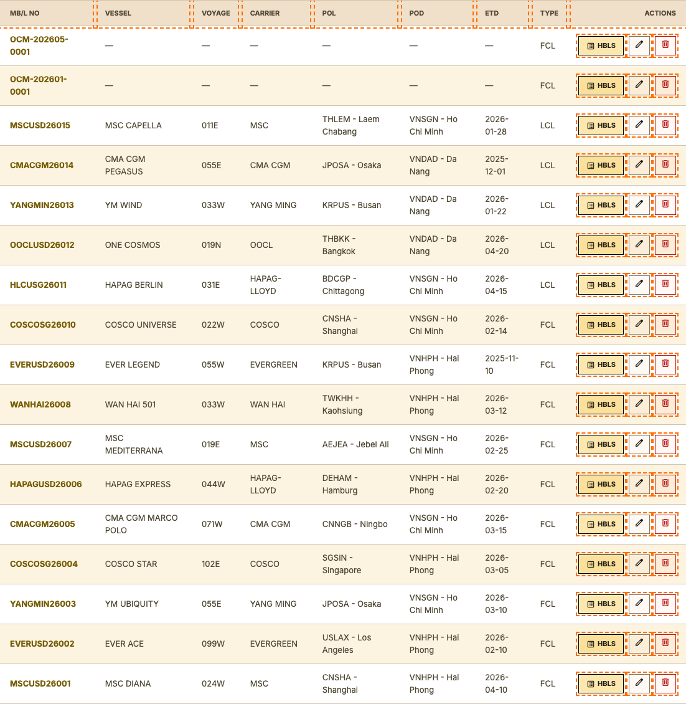
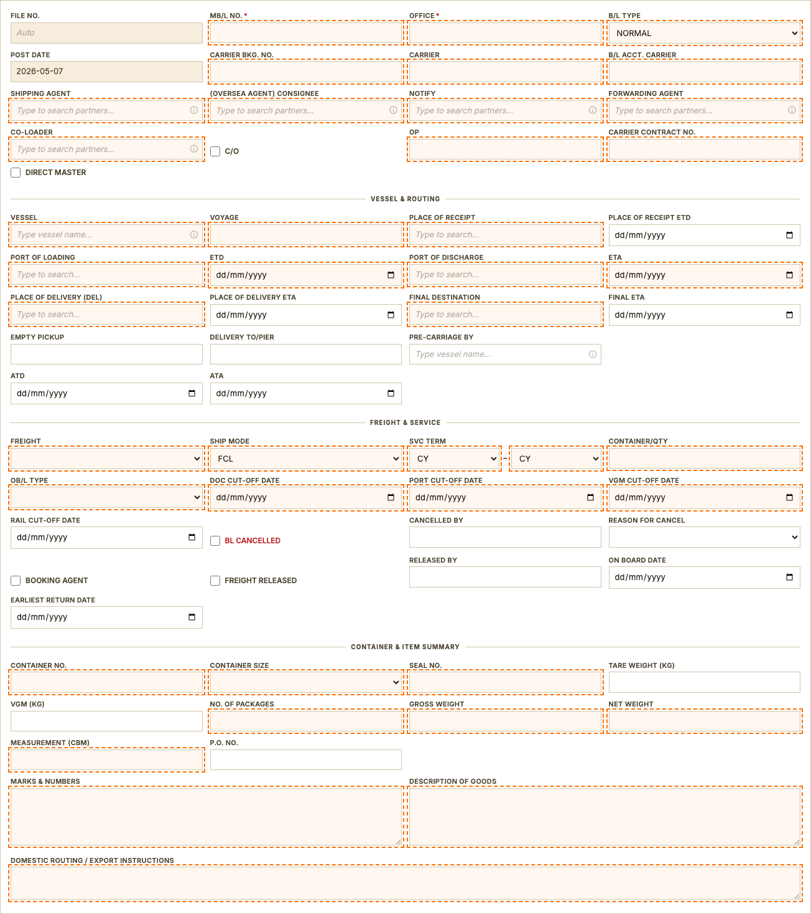
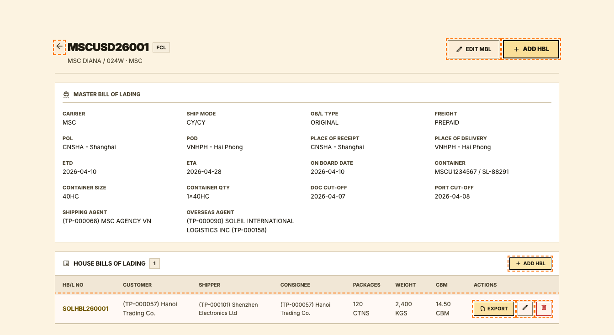
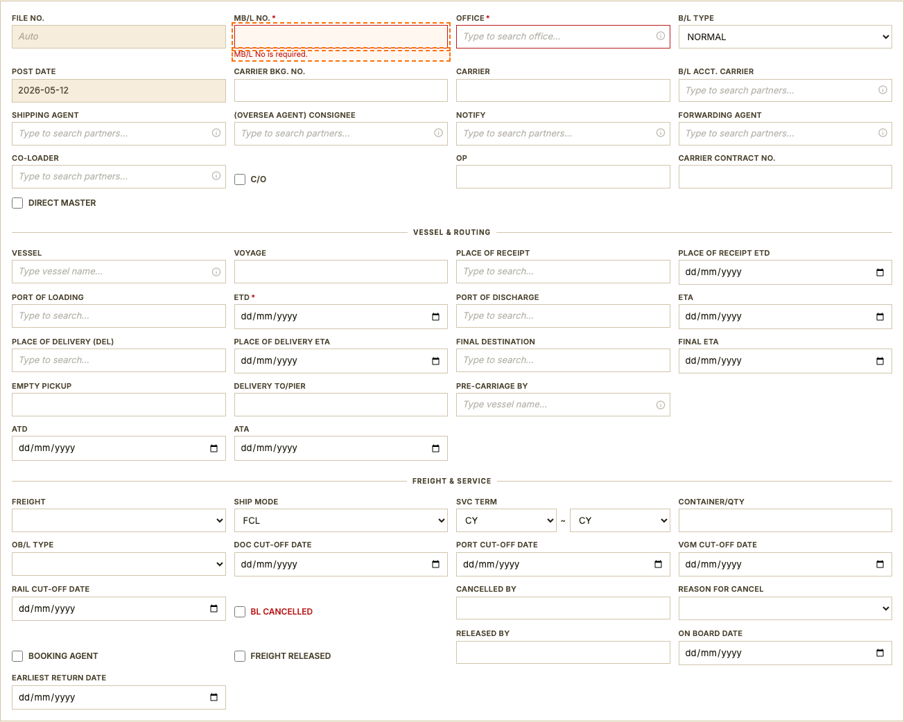

# Master Bill of Lading (MBL)

## User Story
As an Ocean Export operator, I want to create, view, and validate MBL records so that carrier-level shipment documents are complete, traceable, and ready for carrier submission.

## Form Sections
1. Vessel & Routing
2. Freight & Service
3. Container & Item Summary

## UI Evidence

_Shipment list filtered to ocean mode — entry point to MBL management._

_New MBL form — all sections visible on one page._

_MBL detail view for a seeded record — shows all populated fields and HBL sub-list._

_Submit empty MBL form to capture required-field error state._

## Acceptance Criteria
1. User can navigate to the list and open the create form without a UI error or blank screen.
2. All form sections (Identification, Vessel & Routing, Freight & Service, Container & Item Summary) are rendered and scrollable.
3. Submitting the form with empty required fields shows inline error messages without a page reload.
4. A valid record can be saved and the system redirects to the detail/list view with the new record visible.
5. All dropdown (select) options match the values defined in the application constants.
6. Date fields only accept valid date input (ISO YYYY-MM-DD) and do not accept free-form text.

## Validation Rules
1. **MB/L No.*** (`name="mbl_no"`) must not be empty; form must block submission and highlight the field with an error message.
2. **Office*** (`name="office"`) must not be empty; form must block submission and highlight the field with an error message.

## Field Semantics
| Label | Name | Required | Business Meaning | Allowed Values / Format | Data Source / Reference |
|---|---|---|---|---|---|
| MB/L No.* | `mbl_no` | No | The carrier's official shipment reference number as it appears on the Master Bill of Lading. Must match the booking confirmation issued by the shipping line. | Free text | Entered directly by the user and stored in the shipment record. |
| Office* | `office` | No | The Soleil branch office responsible for filing and managing this shipment. | Free text | Entered directly by the user and stored in the shipment record. |
| B/L Type | `bl_type` | No | Defines the commercial arrangement for how this Bill of Lading is structured and billed — e.g., whether it is a direct shipment, a consolidation, or a co-load. | CARRIER BUYER CONSOL, CO-LOAD, CONSOL, DIRECT, DIRECT TRIANGLE, FORWARDING, NORMAL, THIRD PARTY, TRIANGLE | Fixed dropdown list configured in the application. |
| Carrier Bkg. No. | `carrier_bkg_no` | No | The booking confirmation number provided by the carrier (shipping line). Confirms that space has been reserved on the vessel. | Free text | Entered directly by the user and stored in the shipment record. |
| Carrier | `carrier` | No | Name of the shipping line (carrier) transporting the cargo. | Free text | Entered directly by the user and stored in the shipment record. |
| B/L Acct. Carrier | `bl_acct_carrier` | No | The carrier name used strictly for accounting and invoicing. May differ from the operating carrier in interline or transshipment arrangements. | Free text | Entered directly by the user and stored in the shipment record. |
| Shipping Agent | `shipping_agent_id` | No | The shipping agent responsible for vessel coordination and cargo handling at the port of loading. | Free text | Trade Partner lookup — internal partner database (GET /trade-partners/). Search by company name or partner code. New partners must be created in the Trade Partners module first. |
| (Oversea Agent) Consignee | `overseas_agent_id` | No | The overseas partner or destination consignee who will handle the shipment at the destination. | Free text | Trade Partner lookup — internal partner database (GET /trade-partners/). Search by company name or partner code. New partners must be created in the Trade Partners module first. |
| Notify | `notify_party_id` | No | The party to be notified when the cargo arrives at the destination port. Typically the consignee or their broker. | Free text | Trade Partner lookup — internal partner database (GET /trade-partners/). Search by company name or partner code. New partners must be created in the Trade Partners module first. |
| Forwarding Agent | `forwarding_agent_id` | No | The freight forwarder coordinating the shipment on behalf of the shipper. | Free text | Trade Partner lookup — internal partner database (GET /trade-partners/). Search by company name or partner code. New partners must be created in the Trade Partners module first. |
| Co-loader | `co_loader_id` | No | The co-loading partner that shares container space on this shipment. | Free text | Trade Partner lookup — internal partner database (GET /trade-partners/). Search by company name or partner code. New partners must be created in the Trade Partners module first. |
| C/O | `co_flag` | No | Check this box if a Certificate of Origin is required for this shipment. | Yes / No | Entered directly by the user and stored in the shipment record. |
| OP | `op` | No | The operations staff member assigned as the primary handler for this shipment. | Free text | Entered directly by the user and stored in the shipment record. |
| Carrier Contract No. | `carrier_contract_no` | No | Reference number for the service contract or negotiated rate agreement with the carrier. | Free text | Entered directly by the user and stored in the shipment record. |
| Direct Master | `direct_master` | No | Indicates that this shipment moves directly under a master BL without co-loading or consolidation with other cargo. | Yes / No | Entered directly by the user and stored in the shipment record. |
| Vessel | `vessel_id` | No | The vessel selected to carry this shipment. Search by vessel name or IMO number. If the vessel is not in the system, it can be added directly from the search field. | Free text | Vessel lookup — internal vessel register (GET /vessels/). Search by name or 7-digit IMO number. If not found, the vessel can be added inline via the quick-add form. |
| Voyage | `voyage_no` | No | The voyage number assigned by the carrier for this specific sailing. | Free text | Entered directly by the user and stored in the shipment record. |
| Place of Receipt | `place_of_receipt` | No | The location where Soleil or its agent takes custody of the cargo from the shipper — the starting point of Soleil's responsibility. | Free text | Location lookup — UN/LOCODE database (GET /api/locations). Type at least 2 characters to search by city name or LOCODE code. |
| Place of Receipt ETD | `place_of_receipt_etd` | No | Estimated departure date from the place of receipt (inland origin). | Date (YYYY-MM-DD) | Entered directly by the user and stored in the shipment record. |
| Port of Loading | `port_of_loading` | No | The seaport where the cargo is loaded onto the ocean vessel. | Free text | Location lookup — UN/LOCODE database (GET /api/locations). Type at least 2 characters to search by city name or LOCODE code. |
| ETD | `etd` | No | Estimated departure date of the vessel from the port of loading. | Date (YYYY-MM-DD) | Entered directly by the user and stored in the shipment record. |
| Port of Discharge | `port_of_discharge` | No | The seaport where the cargo is unloaded from the vessel. | Free text | Location lookup — UN/LOCODE database (GET /api/locations). Type at least 2 characters to search by city name or LOCODE code. |
| ETA | `eta` | No | Estimated arrival date of the vessel at the port of discharge. | Date (YYYY-MM-DD) | Entered directly by the user and stored in the shipment record. |
| Place of Delivery (DEL) | `place_of_delivery` | No | The final delivery point where Soleil hands over the cargo to the consignee. | Free text | Location lookup — UN/LOCODE database (GET /api/locations). Type at least 2 characters to search by city name or LOCODE code. |
| Place of Delivery ETA | `place_of_delivery_eta` | No | Estimated arrival date at the final delivery location. | Date (YYYY-MM-DD) | Entered directly by the user and stored in the shipment record. |
| Final Destination | `final_destination` | No | The ultimate end destination of the cargo, which may be further inland beyond the port of delivery. | Free text | Location lookup — UN/LOCODE database (GET /api/locations). Type at least 2 characters to search by city name or LOCODE code. |
| Final ETA | `final_eta` | No | Estimated arrival date at the final destination. | Date (YYYY-MM-DD) | Entered directly by the user and stored in the shipment record. |
| Empty Pickup | `empty_pickup` | No | The depot or location where the shipper picks up the empty container before stuffing. | Free text | Location lookup — UN/LOCODE database (GET /api/locations). Type at least 2 characters to search by city name or LOCODE code. |
| Delivery To/Pier | `delivery_to_pier` | No | The terminal or pier location where the loaded container is delivered for vessel loading. | Free text | Location lookup — UN/LOCODE database (GET /api/locations). Type at least 2 characters to search by city name or LOCODE code. |
| Pre-carriage by | `pre_carriage_by` | No | The mode of transport (truck, rail, feeder vessel) used to move cargo from the place of receipt to the port of loading. | Free text | Entered directly by the user and stored in the shipment record. |
| ATD | `atd` | No | Actual date and time the vessel departed the port of loading. Updated once confirmed. | Date (YYYY-MM-DD) | Entered directly by the user and stored in the shipment record. |
| ATA | `ata` | No | Actual date and time the vessel arrived at the port of discharge. Updated once confirmed. | Date (YYYY-MM-DD) | Entered directly by the user and stored in the shipment record. |
| Freight | `freight_type` | No | Indicates who pays the ocean freight charges — the shipper (Prepaid) or the consignee (Collect). | PREPAID, COLLECT | Fixed dropdown list configured in the application. |
| Ship Mode | `ship_mode` | No | The type of cargo arrangement for this shipment — how the container or cargo space is booked. | FCL, LCL, FAK, BULK | Fixed dropdown list configured in the application. |
| SVC Term | `svc_term_origin` | No | Defines the scope of Soleil's service at the origin — the point from which Soleil takes responsibility for the cargo. | BT, CFS, CY, DOOR, FI, FO, FOT, RAMP, TACKLE | Fixed dropdown list configured in the application. |
| SVC Term | `svc_term_dest` | No | Defines the scope of Soleil's service at the destination — the point until which Soleil is responsible for the cargo. | BT, CFS, CY, DOOR, FI, FO, FOT, RAMP, TACKLE | Fixed dropdown list configured in the application. |
| Container/Qty | `container_qty` | No | The total number of containers booked on this shipment. | Free text | Entered directly by the user and stored in the shipment record. |
| OB/L Type | `ob_bl_type` | No | The format of the original Bill of Lading issued to the shipper — determines how the document is released and negotiated. | EXPRESS BILL OF LADING, ORIGINAL BILL OF LADING, SEAWAY BILL, ELECTRONIC BL (EBL) & IBL | Fixed dropdown list configured in the application. |
| Doc Cut-Off Date | `doc_cut_off_date` | No | The deadline for submitting all shipping instructions (SI) and documents to the carrier. Missing this deadline may delay the shipment. | Date (YYYY-MM-DD) | Entered directly by the user and stored in the shipment record. |
| Port Cut-Off Date | `port_cut_off_date` | No | The deadline for delivering loaded containers to the terminal. Cargo arriving after this time will miss the vessel. | Date (YYYY-MM-DD) | Entered directly by the user and stored in the shipment record. |
| VGM Cut-Off Date | `vgm_cut_off_date` | No | The deadline for submitting the Verified Gross Mass (VGM) — the certified total weight of the packed container — to the carrier, as required by international regulations. | Date (YYYY-MM-DD) | Entered directly by the user and stored in the shipment record. |
| Rail Cut-Off Date | `rail_cut_off_date` | No | For shipments moving by rail to the port, this is the deadline for cargo to be at the rail ramp. | Date (YYYY-MM-DD) | Entered directly by the user and stored in the shipment record. |
| BL Cancelled | `bl_cancelled` | No | Marks this Bill of Lading as cancelled. A cancelled BL cannot be used for shipping or customs clearance. | Yes / No | Entered directly by the user and stored in the shipment record. |
| Cancelled By | `cancelled_by` | No | The name of the staff member who authorized the cancellation. | Free text | Entered directly by the user and stored in the shipment record. |
| Reason for Cancel | `reason_for_cancel` | No | The business reason for cancelling this Bill of Lading, used for audit and reporting purposes. | CUSTOMER REQUEST, DUPLICATE, AMENDMENT, OTHER | Fixed dropdown list configured in the application. |
| Booking Agent | `booking_agent` | No | Check this box if the booking was arranged through an agent rather than placed directly with the carrier. | Yes / No | Entered directly by the user and stored in the shipment record. |
| Freight Released | `freight_released` | No | Indicates that all outstanding freight charges have been paid and the BL has been approved for cargo release. | Yes / No | Entered directly by the user and stored in the shipment record. |
| Released By | `released_by` | No | The staff member who approved and confirmed freight release. | Free text | Entered directly by the user and stored in the shipment record. |
| On Board Date | `on_board_date` | No | The date the cargo was physically loaded and confirmed on board the vessel. | Date (YYYY-MM-DD) | Entered directly by the user and stored in the shipment record. |
| Earliest Return Date | `earliest_return_date` | No | The earliest date the carrier will accept empty container returns to the depot after delivery. | Date (YYYY-MM-DD) | Entered directly by the user and stored in the shipment record. |
| Container No. | `container_no` | No | The ISO container identification number printed on the container door (e.g. MSCU1234567). | Free text | Entered directly by the user and stored in the shipment record. |
| Container Size | `container_size` | No | The container equipment type and physical size used for this shipment. | 20GP, 40GP, 40HC, 45HC, 20RF, 40RF | Fixed list — container equipment codes per ISO standards. |
| Seal No. | `seal_no` | No | The seal number applied to the container door after loading. Required for customs verification and cargo security. | Free text | Entered directly by the user and stored in the shipment record. |
| Tare Weight (KG) | `tare_weight` | No | The weight of the empty container itself, as stamped on the container door panel. | Free text | Entered directly by the user and stored in the shipment record. |
| VGM (KG) | `vgm` | No | Verified Gross Mass — the total certified weight of the loaded container, required by SOLAS international maritime regulations. | Free text | Entered directly by the user and stored in the shipment record. |
| No. of Packages | `number_of_packages` | No | Total count of individual packages, boxes, cartons, pallets, or other shipping units. | Free text | Entered directly by the user and stored in the shipment record. |
| Gross Weight | `gross_weight` | No | Total weight of the cargo plus all packaging, pallets, and wrapping. | Free text | Entered directly by the user and stored in the shipment record. |
| Net Weight | `net_weight` | No | Weight of the cargo alone, excluding all packaging materials. | Free text | Entered directly by the user and stored in the shipment record. |
| Measurement (CBM) | `measurement` | No | Total volume of the shipment in cubic meters (CBM). | Free text | Entered directly by the user and stored in the shipment record. |
| P.O. No. | `po_no` | No | The buyer's Purchase Order number associated with this shipment, for cross-referencing with the customer's procurement records. | Free text | Entered directly by the user and stored in the shipment record. |
| Marks & Numbers | `marks_numbers` | No | Shipping marks and package identification numbers printed on the cargo as they must appear on the Bill of Lading. | Free text (multi-line) | Entered directly by the user and stored in the shipment record. |
| Description of Goods | `description_of_goods` | No | The official cargo description as it will appear on the Bill of Lading and customs documents. Must be accurate and comply with carrier and customs requirements. | Free text (multi-line) | Entered directly by the user and stored in the shipment record. |
| Domestic Routing / Export Instructions | `domestic_routing` | No | Inland transportation instructions for moving cargo within the country of origin, such as truck pickup details or inland depot routing. | Free text (multi-line) | Entered directly by the user and stored in the shipment record. |

## Reference Data & Enum Catalog
| Label | Name | Enum / Lookup Values | Source |
|---|---|---|---|
| B/L Type | `bl_type` | CARRIER BUYER CONSOL, CO-LOAD, CONSOL, DIRECT, DIRECT TRIANGLE, FORWARDING, NORMAL, THIRD PARTY, TRIANGLE | Fixed dropdown list configured in the application. |
| Shipping Agent | `shipping_agent_id` | Lookup — see Data Source | Trade Partner lookup — internal partner database (GET /trade-partners/). Search by company name or partner code. New partners must be created in the Trade Partners module first. |
| (Oversea Agent) Consignee | `overseas_agent_id` | Lookup — see Data Source | Trade Partner lookup — internal partner database (GET /trade-partners/). Search by company name or partner code. New partners must be created in the Trade Partners module first. |
| Notify | `notify_party_id` | Lookup — see Data Source | Trade Partner lookup — internal partner database (GET /trade-partners/). Search by company name or partner code. New partners must be created in the Trade Partners module first. |
| Forwarding Agent | `forwarding_agent_id` | Lookup — see Data Source | Trade Partner lookup — internal partner database (GET /trade-partners/). Search by company name or partner code. New partners must be created in the Trade Partners module first. |
| Co-loader | `co_loader_id` | Lookup — see Data Source | Trade Partner lookup — internal partner database (GET /trade-partners/). Search by company name or partner code. New partners must be created in the Trade Partners module first. |
| Vessel | `vessel_id` | Lookup — see Data Source | Vessel lookup — internal vessel register (GET /vessels/). Search by name or 7-digit IMO number. If not found, the vessel can be added inline via the quick-add form. |
| Place of Receipt | `place_of_receipt` | Lookup — see Data Source | Location lookup — UN/LOCODE database (GET /api/locations). Type at least 2 characters to search by city name or LOCODE code. |
| Port of Loading | `port_of_loading` | Lookup — see Data Source | Location lookup — UN/LOCODE database (GET /api/locations). Type at least 2 characters to search by city name or LOCODE code. |
| Port of Discharge | `port_of_discharge` | Lookup — see Data Source | Location lookup — UN/LOCODE database (GET /api/locations). Type at least 2 characters to search by city name or LOCODE code. |
| Place of Delivery (DEL) | `place_of_delivery` | Lookup — see Data Source | Location lookup — UN/LOCODE database (GET /api/locations). Type at least 2 characters to search by city name or LOCODE code. |
| Final Destination | `final_destination` | Lookup — see Data Source | Location lookup — UN/LOCODE database (GET /api/locations). Type at least 2 characters to search by city name or LOCODE code. |
| Empty Pickup | `empty_pickup` | Lookup — see Data Source | Location lookup — UN/LOCODE database (GET /api/locations). Type at least 2 characters to search by city name or LOCODE code. |
| Delivery To/Pier | `delivery_to_pier` | Lookup — see Data Source | Location lookup — UN/LOCODE database (GET /api/locations). Type at least 2 characters to search by city name or LOCODE code. |
| Freight | `freight_type` | PREPAID, COLLECT | Fixed dropdown list configured in the application. |
| Ship Mode | `ship_mode` | FCL, LCL, FAK, BULK | Fixed dropdown list configured in the application. |
| SVC Term | `svc_term_origin` | BT, CFS, CY, DOOR, FI, FO, FOT, RAMP, TACKLE | Fixed dropdown list configured in the application. |
| SVC Term | `svc_term_dest` | BT, CFS, CY, DOOR, FI, FO, FOT, RAMP, TACKLE | Fixed dropdown list configured in the application. |
| OB/L Type | `ob_bl_type` | EXPRESS BILL OF LADING, ORIGINAL BILL OF LADING, SEAWAY BILL, ELECTRONIC BL (EBL) & IBL | Fixed dropdown list configured in the application. |
| Reason for Cancel | `reason_for_cancel` | CUSTOMER REQUEST, DUPLICATE, AMENDMENT, OTHER | Fixed dropdown list configured in the application. |
| Container Size | `container_size` | 20GP, 40GP, 40HC, 45HC, 20RF, 40RF | Fixed list — container equipment codes per ISO standards. |

