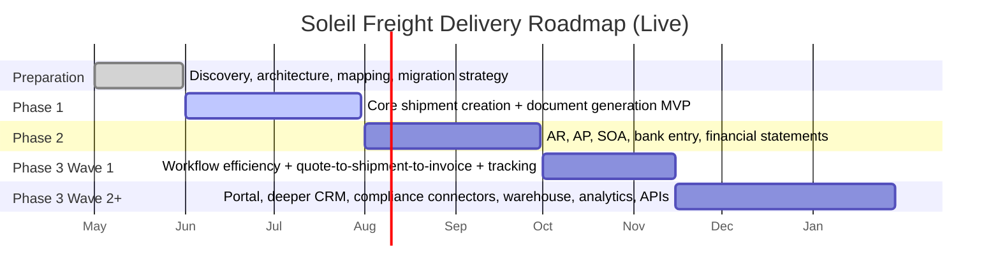

# Program Roadmap

This page is the live planning board for the in-house Soleil Freight replacement program. It is optimized for horizontal viewing so timeline and phase dependencies are easier to read.

## Current Progress Snapshot

| Stage | Status | Progress | Current Focus | Owner |
|---|---|---:|---|---|
| Preparation | Done | 100% | Discovery, architecture baseline, field mapping prepared. | PM + Tech Lead |
| Phase 1 (Operations + Docs) | In Progress | 55% | Shipment core and document generation flows. | Product Owner / Operations Lead |
| Phase 2 (Finance Layer) | Planned | 10% | AR/AP scope definition and accounting model alignment. | Finance Lead |
| Phase 3 Wave 1 (Automation) | Planned | 0% | Quote-to-shipment-to-invoice workflow and milestone automation. | PM + Tech Lead |
| Phase 3 Wave 2+ (Expansion) | Backlog | 0% | Portal, deeper CRM, compliance connectors, analytics, APIs. | Executive Sponsor + Product |

## Indicative 6-Month Timeline

  

  

## Phase Outcomes (Horizontal View)

  

  

  

    <h3>Preparation</h3>
    
<strong>Output:</strong> Approved blueprint and prioritized backlog.

    
<strong>Status:</strong> Done

  

  

    <h3>Phase 1</h3>
    
<strong>Output:</strong> Operational MVP for shipment creation and document generation.

    
<strong>Status:</strong> In progress

  

  

    <h3>Phase 2</h3>
    
<strong>Output:</strong> Finance-enabled release with controlled month-end process.

    
<strong>Status:</strong> Planned

  

  

    <h3>Phase 3 Wave 1</h3>
    
<strong>Output:</strong> Higher automation and lower duplicate entry.

    
<strong>Status:</strong> Planned

  

  

    <h3>Phase 3 Wave 2+</h3>
    
<strong>Output:</strong> Digital expansion platform.

    
<strong>Status:</strong> Backlog

  

## How To Update Progress (Quick)

1. Update the `Current Progress Snapshot` table (status, %, focus, owner).
2. Update Mermaid task state using `done`, `active`, or plain task in the timeline.
3. Update phase cards if a stage changes from planned to active/done.
4. Keep one source of truth here so stakeholders can track progress visually.
